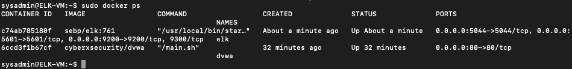

## Automated ELK Stack Deployment
CyberProject:
The files in this repository were used to configure the network depicted below.


These files have been tested and used to generate a live ELK deployment on Azure. They can be used to either recreate the entire deployment pictured above. Alternatively, select portions of the yml file may be used to install only certain pieces of it, such as Filebeat.

  - _TODO: Enter the playbook file._

This document contains the following details:
- Description of the Topologu
- Access Policies
- ELK Configuration
  - Beats in Use
  - Machines Being Monitored
- How to Use the Ansible Build


### Description of the Topology

The main purpose of this network is to expose a load-balanced and monitored instance of DVWA, the D*mn Vulnerable Web Application.

Load balancing ensures that the application will be highly available, in addition to restricting access to the network.
- Load balancer protect from distributed denial-of-service (DDoS) attacks. 
- Jump box restrict access to admins
- Integrating an ELK server allows users to easily monitor the vulnerable VMs for changes to the event log and system metrics.
- Filebeat monitors the log files or locations that you specify, collects log events, and forwards them either to Elasticsearch or Logstash for indexing
- Metricbeattakes the metrics and statistics that it collects and ships them to the output that you specify, such as Elasticsearch or Logstash.

The configuration details of each machine may be found below.
_Note: Use the [Markdown Table Generator](http://www.tablesgenerator.com/markdown_tables) to add/remove values from the table_.

| Name     | Function | IP Address | Operating System |
|----------|----------|------------|------------------|
| Jump Box | Gateway  | 10.0.0.1   | Linux            |
| Web 1    | Server   | 10.1.0.8   | Linux            |
| Web 2    | Server   | 10.1.0.6   | Linux            |
| Web 3    | Server   | 10.1.0.9   | Linux            |
| ELK      | ELKStack | 10.3.0.4   | Linux            |

### Access Policies

The machines on the internal network are not exposed to the public Internet. 

Only the jump box machine can accept connections from the Internet. Access to this machine is only allowed from the following IP addresses:
- _public ip address: 20.37.240.66

Machines within the network can only be accessed by DVWA container .
- the elk server 20.194.112.252 was accessed by my machine and jump box 20.37.240.66 via peer connection

A summary of the access policies in place can be found in the table below.

| Name     | Publicly Accessible | Allowed IP Addresses |
|----------|---------------------|----------------------|
| Jump Box | yes                 |  10.1.0.4, 20.37.240.66       |
| Load Balancer | no               |                      |
| Web 1         | NO             |   10.1.0.8                    |
| Web 2         | NO             |  10.1.0.6                     |
| Web 3         | No             |   10.1.0.9                  |
| elk         | No             |   10.3.0.4                  |


### Elk Configuration

Ansible was used to automate configuration of the ELK machine. No configuration was performed manually, which is advantageous because...
- Ansible can run from the command line

The playbook implements the following tasks:
- install docker.io
- install python3-pip
- install docker module

`ansible-playbook install-elk.yml`
```
---
- name: Configure Elk VM with Docker
  hosts: elk
  remote_user: sysadmin
  become: true
  tasks:
    # Use apt module
    - name: Install docker.io
      apt:
        update_cache: yes
        force_apt_get: yes
        name: docker.io
        state: present

      # Use apt module
    - name: Install python3-pip
      apt:
        force_apt_get: yes
        name: python3-pip
        state: present

      # Use pip module (It will default to pip3)
    - name: Install Docker module
      pip:
        name: docker
        state: present

      # Use command module
    - name: Increase virtual memory
      command: sysctl -w vm.max_map_count=262144

      # Use sysctl module
    - name: Use more memory
      sysctl:
        name: vm.max_map_count
        value: '262144'
        state: present
        reload: yes

      # Use docker_container module
    - name: download and launch a docker elk container
      docker_container:
        name: elk
        image: sebp/elk:761
        state: started
        restart_policy: always
        # Please list the ports that ELK runs on
        published_ports:
          -  5601:5601
          -  9200:9200
          -  5044:5044

      # Use systemd module
    - name: Enable service docker on boot
      systemd:
        name: docker
        enabled: yes

```
The following screenshot displays the result of running `docker ps` after successfully configuring the ELK instance.



### Target Machines & Beats
This ELK server is configured to monitor the following machines:
- Web 1 - 10.1.0.8
- Web 2 - 10.1.0.6
- Web 3 - 10.1.0.9

We have installed the following Beats on these machines:
- filebeat-7.4.0-amd64.deb and metricbeat-7.6.1-amd64.deb

These Beats allow us to collect the following information from each machine:
- filebeat: monitors the log files or locations that you specify, collects log events, and forwards them either to Elasticsearch or Logstash for indexing.
- metric beat: Collect metrics from your systems and services.

### Using the Playbook
In order to use the playbook, you will need to have an Ansible control node already configured. Assuming you have such a control node provisioned: 

SSH into the control node and follow the steps below:
- Copy the filebeat-configuration.yml and metricbeat-configuration.yml  file to ELK_VM.
- Update the hosts file to include the three [webserver] and [elkserver]
- Run the playbook, and navigate to Kibana to check that the installation worked as expected.

_TODO: Answer the following questions to fill in the blanks:_
- _Which file is the playbook? Where do you copy it?_
- _Which file do you update to make Ansible run the playbook on a specific machine? How do I specify which machine to install the ELK server on versus which to install Filebeat on?_ 
- _Which URL do you navigate to in order to check that the ELK server is running?  http://[your.VM.IP]:5601/app/kibana


`ansible-playbook filebeat-playbook.yml`
```
Sample Username: RedTeam
---
- name: installing and launching filebeat
  hosts: webservers
  become: yes
  tasks:

  - name: download filebeat deb
    command: curl -L -O https://artifacts.elastic.co/downloads/beats/filebeat/filebeat-7.6.1-amd64.deb

  - name: install filebeat deb
    command: sudo dpkg -i filebeat-7.6.1-amd64.deb

  - name: drop in filebeat.yml
    copy:
      src: /etc/ansible/files/filebeat-config.yml
      dest: /etc/filebeat/filebeat.yml

  - name: enable and configure system module
    command: filebeat modules enable system

   - name: setup filebeat
     command: filebeat setup

   - name: start filebeat service
     command: service filebeat start

   - name: enable service filebeat on boot
     systemd:
       name: filebeat
       enabled: yes

```

`ansible-playbook metricbeat-playbook.yml`

```
---
- name: Install metric beat
  hosts: webservers
  become: true
  tasks:
    # Use command module
  - name: Download metricbeat
    command: curl -L -O https://artifacts.elastic.co/downloads/beats/metricbeat/metricbeat-7.6.1-amd64.deb

    # Use command module
  - name: install metricbeat
    command: dpkg -i metricbeat-7.6.1-amd64.deb

    # Use copy module
  - name: drop in metricbeat config
    copy:
      src: /etc/ansible/files/metricbeat-config.yml
      dest: /etc/metricbeat/metricbeat.yml

    # Use command module
  - name: enable and configure docker module for metric beat
    command: metricbeat modules enable docker

    # Use command module
  - name: setup metric beat
    command: metricbeat setup

    # Use command module
  - name: start metric beat
    command: service metricbeat start

    # Use systemd module
  - name: enable service metricbeat on boot
    systemd:
      name: metricbeat
      enabled: yes

```

_As a **Bonus**, provide the specific commands the user will need to run to download the playbook, update the files, etc._

Open up command line on MacOS. To log into the jump box provisisoner, input the following commandm and to run the kibana, do the rest:
- ssh RedTeam@20.37.240.66
- sudo docker container list -a
- sudo docker start magical_visvesvaraya
- sudo docker attach magical_visvesvaraya
- cd /etc/ansible
- nano hosts 
    - add the private IP of the web VM under [Webserver]
- ansible-playbook install-elk.yml
- ansible-playbook roles/filebeat-playbook.yml
- ansible-playbook roles/metricbeat-playbook.yml
- open browser: http://20.37.240.66:5601/app/kibana


